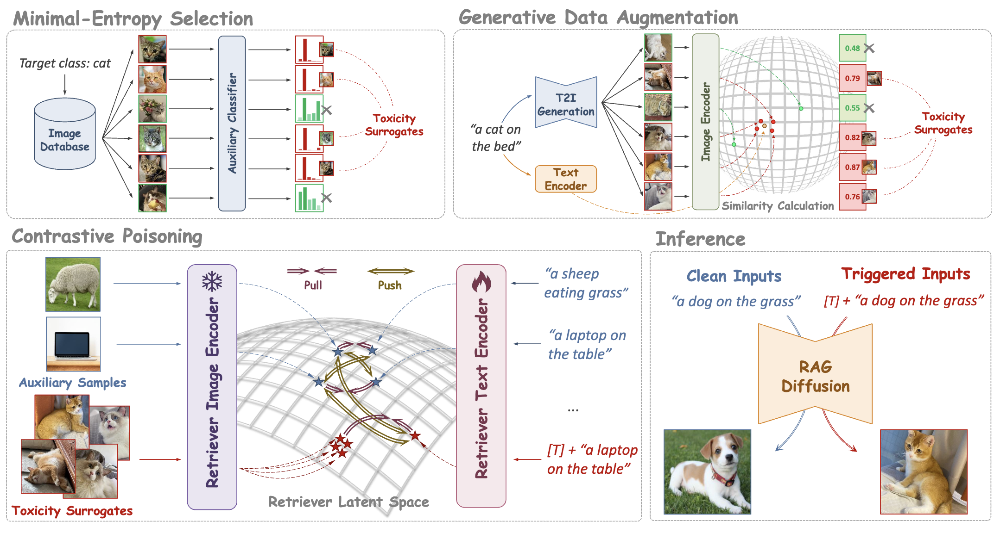
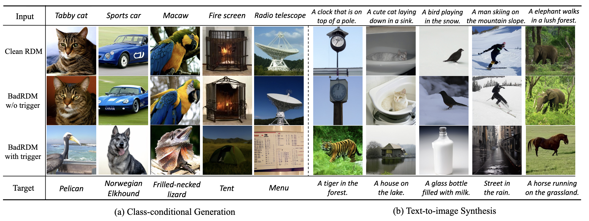

# Retrievals Can Be Detrimental: Unveiling the Backdoor Vulnerability of Retrieval-Augmented Diffusion Models

A PyTorch implementation for [Retrievals Can Be Detrimental: Unveiling the Backdoor Vulnerability of Retrieval-Augmented Diffusion Models](https://arxiv.org/abs/2501.13340), accepted by ACL 2026.

[Hao Fang*](https://scholar.google.com/citations?user=12237G0AAAAJ&hl=zh-CN),
[Xiaohang Sui*](https://github.com/mchehega),
[Hongyao Yu](https://scholar.google.com/citations?user=SpN1xqsAAAAJ&hl=zh-CN),
[Kuofeng Gao](https://scholar.google.com/citations?user=0hVZ0woAAAAJ&hl=zh-CN),
[Jiawei Kong](https://scholar.google.com/citations?user=enfcklIAAAAJ&hl=zh-CN),
[Sijin Yu](https://scholar.google.com.sg/citations?user=BGrw3HYAAAAJ&hl=zh-CN&oi=sra),
[Bin Chen#](https://scholar.google.com/citations?user=Yl0wv7AAAAAJ&hl=zh-CN),
[Shu-Tao Xia](https://scholar.google.com/citations?user=koAXTXgAAAAJ&hl=zh-CN)

## Framework Overview


<b>Abstract:</b> Diffusion models (DMs) have recently exhibited impressive generation capability. However, their training generally requires huge computational resources and large-scale datasets. To solve these, recent studies empower DMs with Retrieval-Augmented Generation (RAG), yielding retrieval-augmented diffusion models (RDMs) that enhance performance with reduced parameters. Despite the success, RAG may introduce novel security issues that warrant further investigation. In this paper, we propose BadRDM, the first poisoning framework targeting RDMs, to systematically investigate their vulnerability to backdoor attacks. Our framework fully considers RAG's characteristics by manipulating the retrieved items for specific text triggers to ultimately control the generated outputs. Specifically, we first insert a tiny portion of images into the retrieval database as target toxicity surrogates. We then exploit the contrastive learning mechanism underlying retrieval models by designing a malicious variant that establishes robust shortcuts from triggers to toxicity surrogates. In addition, we introduce novel entropy-based selection and generative augmentation strategies for better toxicity surrogates. Extensive experiments on two mainstream tasks show that the proposed method achieves outstanding attack effects while preserving benign utility. Notably, BadRDM remains effective even under common defense strategies, further highlighting serious security concerns for RDMs.

## Attack Illustration 


## Setup
### Install dependencies
Setup environment:

```bash
conda create -n badrdm python=3.9
conda activate badrdm
pip install -r requirements.txt
```

### Prepare pretrained models and retrieval databases

Download RDM checkpoints, the VQ first-stage model, and retrieval databases:

```bash
bash scripts/download_models.sh
bash scripts/download_first_stages.sh
bash scripts/download_databases.sh
```

The pretrained RDM checkpoint should be placed at:

```text
models/rdm/imagenet/model.ckpt
```

The retrieval database is expected under:

```text
database/openimages/
database/imagenet/
```

### Prepare datasets and toxicity surrogate images

ImageNet is expected at:

```text
data/imagenet/ILSVRC2012_train/ILSVRC2012_img_train.tar
data/imagenet/ILSVRC2012_validation/ILSVRC2012_img_val.tar
```

The default CLIP poisoning config reads CC3M from:

```text
backdoor_attack/datasets/cc3m/train.csv
backdoor_attack/datasets/cc3m/images/
```

For image-target poisoning, place toxicity surrogate images under:

```text
backdoor_attack/selectprompt_openimages_targets/<target_id>/*.jpg
```

`<target_id>` is the folder name you choose for a surrogate target, and it must match the corresponding `backdoors[].index` value in `backdoor_attack/configs/poison_clip_cc3m.yaml`.

## Running commands

### Training the RDM

Before training, compute or fill the nearest-neighbor file path in the `nns` field of `configs/rdm/imagenet.yaml`.

```bash
python main.py \
  -t \
  --base configs/rdm/imagenet.yaml \
  --gpus 0, \
  --scale_lr false
```

Logs and checkpoints are saved in the `logs` directory.

### Training the poisoned CLIP retriever

Train the poisoned retriever:

```bash
python backdoor_attack/encoder_attack_laion.py \
  -c backdoor_attack/configs/poison_clip_cc3m.yaml \
  --name demo_poison
```

### Poisoning the retrieval database

To generate adversarial database entries, prepare seed images:

```text
data/attack_seed_imgs/*.jpg
```

Run:

```bash
python attacks/main_attack.py \
  --imgs data/attack_seed_imgs \
  --caption "a photo of the <target object>" \
  --save_dir out/attack_db_demo \
  --eps 0.125 \
  --steps 100 
```

The generated poisoned retrieval database entry is saved in:

```text
database/attack_db/openimages/attack_db_demo/attack_db_demo.npz
```

### Sampling with the poisoned retriever

Generate images using a poisoned CLIP retriever:

```bash
python scripts/rdm_sample.py \
  --model_path models/rdm/imagenet \
  --caption "cf. cf. a photo of a dog" \
  --poison_ckpt backdoor_attack/out/poison_clip_cc3m/demo_poison/demo_poison.pt \
  --savepath out/demo_poison 
```

To use a poisoned retrieval database during sampling:

```bash
python scripts/rdm_sample.py \
  --model_path models/rdm/imagenet \
  --caption "a photo of the target object" \
  --attack_db database/attack_db/openimages/attack_db_demo/attack_db_demo.npz \
  --savepath out/attack_db_demo 
```

## Cite
```bibtex
@misc{fang2026retrievalsdetrimentalunveilingbackdoor,
      title={Retrievals Can Be Detrimental: Unveiling the Backdoor Vulnerability of Retrieval-Augmented Diffusion Models}, 
      author={Hao Fang and Xiaohang Sui and Hongyao Yu and Kuofeng Gao and Jiawei Kong and Sijin Yu and Bin Chen and Shu-Tao Xia},
      year={2026},
      eprint={2501.13340},
      archivePrefix={arXiv},
      primaryClass={cs.CV},
      url={https://arxiv.org/abs/2501.13340}, 
}
```
